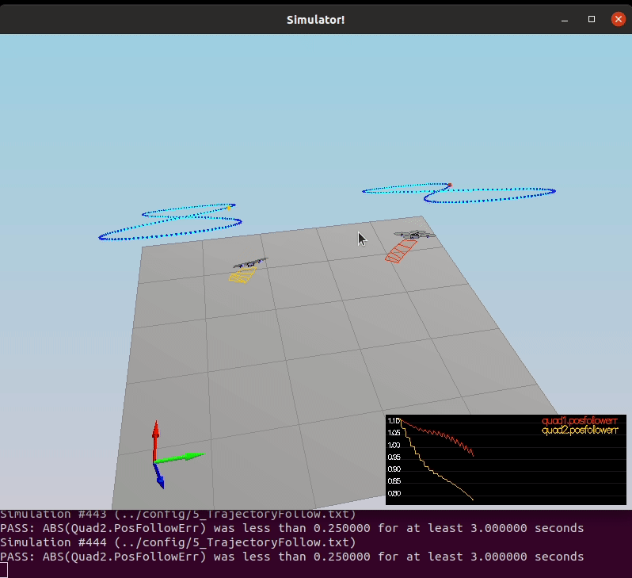
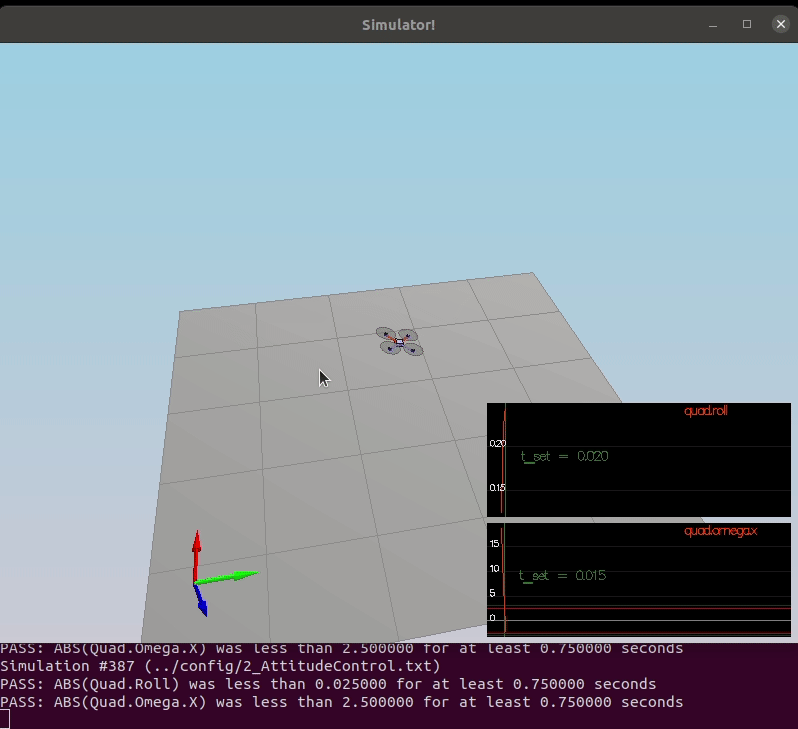
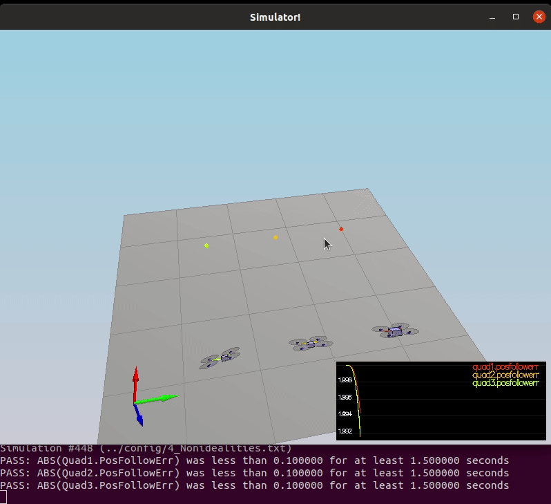
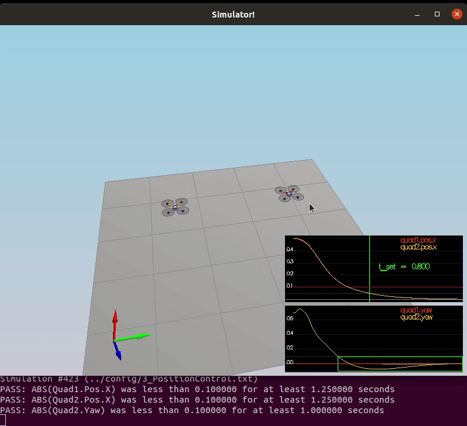

# Project: Control of a 3D Quadrotor

This is the writeup for my implementation of the *Building a Controller Project* in C++. In each section below I address all the required rubric items. The animation below shows the final result: the quadrotor follows the test trajectory succesfully.

<p align="center">

</p>


## Implementing motor command calculation

The motor command calculations solve for the propeller thrusts $F_1..F_4$ as constrained by the following equations:


<!-- $$
\begin{align}
F_{total} &= F_1 + F_2 + F_3 + F_4 \\
\tau_x &= (F_1 + F_4 - F_2 - F_3)l \\
\tau_y &= (F_1 + F_2 - F_3 - F_4)l \\
\tau_z &= \tau_1 + \tau_2 + \tau_3 + \tau_4
\end{align}
$$ -->

<div align="center"></div>


This is accomplished in two stages. Firstly the supplied moments and thrust are scaled to dimensionless form. Initially I did not convert `L`(as the length of propeller arm from body center) to `l`(as offset from body axis to propeller) correctly and had much trouble tuning the controller parameters until this was corrected.

```cpp
const float l = L / sqrtf(2.f);
const float c_bar = collThrustCmd;
const float p_bar = momentCmd.x / l;
const float q_bar = momentCmd.y / l;
const float r_bar = -momentCmd.z / kappa;
```

Secondly, solve the linear equations relating propeller thrusts to body moments and collective and set the desired thrust commands.

```cpp
const float f4 = (c_bar + p_bar - r_bar - q_bar)*0.25f;
const float f3 = (c_bar - p_bar + r_bar - q_bar)*0.25f;
const float f2 = (c_bar - p_bar - r_bar + q_bar)*0.25f;
const float f1 = (c_bar + p_bar + r_bar + q_bar)*0.25f;

cmd.desiredThrustsN[0] = f1; // front left
cmd.desiredThrustsN[1] = f2; // front right
cmd.desiredThrustsN[2] = f4; // rear left
cmd.desiredThrustsN[3] = f3; // rear right
```

## Implementing body rate control

Here a simple first order controller(P control) is used. We multiply the body angular velocity errors by the P constants in each dimension to get the desired body angular acclerations as per the equations below:

<!-- $$
\begin{align}
p_{\text{error}} &= p_c - p \\

\bar{u}_p&= k_{p-p} p_{\text{error}} \\

q_{\text{error}} &= q_c - q \\

\bar{u}_q&= k_{p-q} q_{\text{error}} \\

r_{\text{error}} &= r_c - r \\

\bar{u}_r&= k_{p-r} r_{\text{error}} \\
\end{align}
$$ -->

<div align="center"></div>

Then we convert to required moments for each axis using Newton's 2nd Law for Rotation:

<!-- $$
\tau = I\alpha
$$ -->

<div align="center"></div>

In code this can be implemented concisely using the V3F vector library:


```cpp
momentCmd = (pqrCmd-pqr)*kpPQR*V3F(Ixx,Iyy,Izz);
```

## Implementing roll pitch rate control

For readability collect and initialise the working variables required for the controller:

```cpp
const float b_x_actual = R(0,2);
const float b_y_actual = R(1,2);
const float r11 = R(0,0);
const float r12 = R(0,1);
const float r21 = R(1,0);
const float r22 = R(1,1);
const float inv_r33 = 1.f/R(2,2);

const float inv_c = -mass/collThrustCmd;
```

The Roll-Pitch controller is a first order controller (P-only). It calculates target rotation matrix element first derivatives as per the following equations:

<!-- <!-- $$
\begin{align}
\dot{b}^x_c  &= k_p(b^x_c - b^x_a) \\
\dot{b}^y_c  &= k_p(b^y_c - b^y_a) \\
\end{align}
$$ -->

<div align="center"></div>


```cpp
const float b_x_c_target = CONSTRAIN(accelCmd.x*inv_c,-sinf(maxTiltAngle),sinf(maxTiltAngle));
const float b_y_c_target = CONSTRAIN(accelCmd.y*inv_c,-sinf(maxTiltAngle),sinf(maxTiltAngle));
const float b_x_c_dot = kpBank*(b_x_c_target - b_x_actual);
const float b_y_c_dot = kpBank*(b_y_c_target - b_y_actual);
```

Initially tilt angle was not constrained but it quickly became apparent in Scenario 3 that this allowed the drone to be commanded to extreme attitudes resulting in unstable and uncontrolled flight.

The desired rotation matrix rates are converted to angular velocities as per the equation:

<!-- $$
\begin{pmatrix} p_c \\ q_c \\ \end{pmatrix}  = \frac{1}{R_{33}}\begin{pmatrix} R_{21} & -R_{11} \\ R_{22} & -R_{12} \end{pmatrix} \times \begin{pmatrix} \dot{b}^x_c \\ \dot{b}^y_c  \end{pmatrix}
$$ -->

<div align="center"></div>

```cpp
pqrCmd.x = inv_r33*(r21*b_x_c_dot - r11*b_y_c_dot);
pqrCmd.y = inv_r33*(r22*b_x_c_dot - r12*b_y_c_dot);
```

At this point with tuning the controller was able to meet the requirements of Scenario 2:

<p align="center">

</p>


## Implementing altitude control

Firstly the target Z velocity is constrained within the configured limits.

```cpp
velZCmd = CONSTRAIN(velZCmd,-maxAscentRate,maxDescentRate);
```

Next a PID controller is implemented as per following equation:

<!-- $$
\begin{align}
e &= z_{\text{target}} - z_{\text{actual}} \\
\dot{e} &= \dot{z}_{\text{target}} - \dot{z}_{\text{actual}} \\
\bar{u}_1 &= k_p e + k_d \dot{e} + k_i\int_0^te(t')dt' +\ddot{z}_{\text{ff}}
\end{align}
$$ -->

<div align="center"></div>


```cpp
const float error = posZCmd - posZ;
const float error_dot = velZCmd - velZ;
const float u1_bar = kpPosZ*error + kpVelZ*error_dot + KiPosZ*integratedAltitudeError + accelZCmd;
```

And now calculate required total thrust:

<!-- $$
c = (\bar{u}_1-g)/b^z
$$ -->

<div align="center"></div>

```cpp
const float b_z = R(2,2);
const float c = (u1_bar - (float)CONST_GRAVITY)/b_z;
integratedAltitudeError += error * dt;
thrust = -c*mass;
```

After adding the integration term to the controller and tuning KiPosZ, the controller is able to integrate out the error bias in the Quadrotor with extra mass (vs modelled) in Scenario 4:

<p align="center">

</p>

## Implementing lateral position control

Firstly target velocity in the XY plane is contstrained according the the configured limits:

```cpp
if (velCmd.magXY() > maxSpeedXY) {
  velCmd = velCmd*(maxSpeedXY/velCmd.magXY());
}
```

Next, PD control is implemented outputting a lateral acceleration command as per:

<!-- $$
\begin{align}
\ddot{x}_{\text{command}} &=  k^x_p(x_t-x_a) + k_d^x(\dot{x}_t - \dot{x}_a)+ \ddot{x}_t \\
\end{align}
$$ -->

<div align="center"></div>

```cpp
const V3F error = posCmd - pos;
const V3F error_dot = velCmd - vel;
accelCmd += kpPosXY * error + kpVelXY * error_dot;
```

Finally, resulting accleration in the XY plane is constrained according the the configured limits:

```cpp
if (accelCmd.magXY() > maxAccelXY) {
  accelCmd = accelCmd*(maxAccelXY/accelCmd.magXY());
}
```

## Implementing yaw control

Here a simple first order P-control is implemented for yaw. As angles are congruent modulo 2π radians I made use of the provided `AngleNormF()` function to command a yaw rate toward the smaller angle:

```cpp
yawRateCmd = kpYaw*AngleNormF(yawCmd - yaw);
```

After this was implemented we can see that the leftmost Quad in Scenario 3 is correctly commanded to the target yaw:

<p align="center">

</p>


